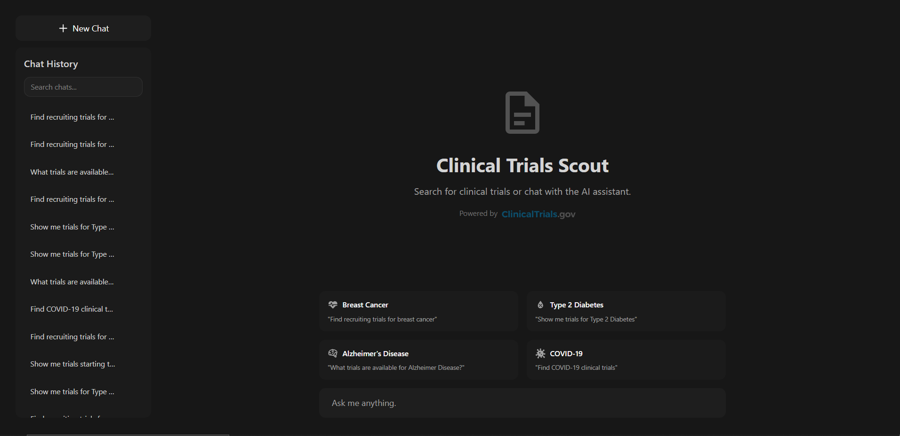

# Clinical Trials Scout



Chat with an LLM to search clinical trials from ClinicalTrials.gov AND query drug/target information from DrugCentral. Ask questions in plain English, get comprehensive results combining both databases.

## What it does

- Ask questions about clinical trials ("Find breast cancer trials in California")
- Query drug information ("What drugs target GPER?")
- Get enriched results combining trial data with drug mechanisms, targets, and FDA approval status
- Get live data from ClinicalTrials.gov API
- Query the DrugCentral pharmaceutical database for drug/target information
- Filter by condition, location, status, and phase automatically
- Save your chat history
- Works on mobile

## Built with

- FastAPI + PostgreSQL
- HTMX + Tailwind CSS
- Anthropic Claude (via litellm)
- Docker

## Run it

1. Clone the repo
```bash
git clone https://github.com/alexandru-tanul/clinical-trials-scout.git
cd clinical-trials-scout
```

2. Copy the example env file
```bash
cp .env.example .env
```

3. Add your Anthropic API key and database passwords to `.env`

4. Download the DrugCentral database (required, ~500MB compressed)
```bash
just setup-drugcentral
```

5. Start it
```bash
docker compose up -d
```

6. Open http://localhost:8000

**Note:** First startup takes 2-3 minutes to initialize the DrugCentral database

## Required env variables

Put these in `.env`:
- `ANTHROPIC_API_KEY` - Get it from Anthropic
- `OPENAI_API_KEY` - Get it from OpenAI (optional, if using OpenAI models)
- `SECRET_KEY` - Any random string for session management
- `POSTGRES_PASSWORD` - Password for main database
- `DRUGCENTRAL_PASSWORD` - Password for DrugCentral database

## Optional env variables

- `MODEL` - Which model to use for tool calling (default: `claude-haiku-4-5`)
- `SYNTHESIS_MODEL` - Which model to use for synthesis (default: `claude-haiku-4-5`)
- `ENABLE_THINKING` - Enable extended thinking for Claude models (default: `False`)
- `DEBUG` - Turn on debug mode (default: `True`)

## Example queries

The LLM automatically decides whether to use ClinicalTrials.gov, DrugCentral, or both:

- "Find trials for breast cancer" → Searches ClinicalTrials.gov only
- "What drugs target GPER?" → Queries DrugCentral only
- "Show me trials for GPER modulators" → Queries DrugCentral for GPER-targeting drugs, then searches trials
- "Find trials for semaglutide and explain its mechanism" → Searches both databases and synthesizes results

## How it works

Uses a state machine to track response generation:
- `pending` → `analyzing` → `tool_calling` → `synthesizing` → `completed`
- Status messages change based on how long each step takes
- Everything runs async so you can use the app while responses generate

## License

Free to use for learning and personal projects.
